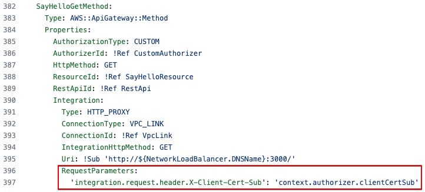

# Propagating valid mTLS client certificate identity to downstream services using Amazon API Gateway

This project contains source code and supporting files for a demo application showcasing usage of Amazon API Gateway and AWS Lambda to implement mTLS, extraction of certificate properties, and propagation of those properties to downstream applications. 

## Architecture


1. The client certificate is stored in a trust store in an Amazon S3 bucket.
2. The client makes a request to the API Gateway endpoint, supplying the
client certificate to establish the mTLS session.
3. API Gateway retrieves the trust store from the S3 bucket, validates the
client certificate, matches the trusted authorities, and terminates the
mTLS connection.
4. API Gateway invokes the Lambda authorizer, providing the request
context and the client certificate information.
5. The Lambda authorizer extracts the client certificate subject, performs
any necessary custom validation, and returns extracted subject to API
Gateway as a part of the authorization context.
6. API Gateway injects the subject extracted in previous step into the
integration request HTTP header and sends the request to downstream
endpoint.
7. The backend application receives the request, extracts the injected
subject, and uses it with custom business logic.

To simulate a VPC environment two subnets will be created - a private and a public one. The backend application running on an EC2 instance will be hosted in a private subnet, so it cannot be reached directly from the public network such as the internet. A public subnet will be created to host the NAT Gateway, so the backend application running in the private subnet can reach out to internet to download updates. 

## Key areas in the sample code

There are two key areas in the sample code that you should pay attention to. 

1. See `src/authorizer/index.js`. The Lambda authorizer code extracts the subject from the client certificate, and returns the value as part of the `context` object back to API Gateway. This allows API Gateway to use this value is the subsequent integration request. 

    

2. See `template.yaml`. The client certificate subject extracted by Lambda authorizer is injected into the integration request as `X-Client-Cert-Sub` HTTP header.

    

## Prerequisites

* This prototype uses `us-east-1` region. But, for any reasons, if you still want to use a different region, change the AMI ID in `template.yaml` file to the appropriate value of the valid AMI in that region as shown below.

    
* An AWS account. To sign up follow instructions at [Sign Up For AWS](https://aws.amazon.com/resources/create-account/).
* [AWS CLI](https://docs.aws.amazon.com/cli/latest/userguide/getting-started-install.html) and [AWS SAM CLI installed](https://docs.aws.amazon.com/serverless-application-model/latest/developerguide/serverless-sam-cli-install.html)
* Existing public hosted zone in Amazon Route53, required for setting up custom domain. See below for details.

Enabling mTLS on API Gateway requires using custom domains. This sample assumes you already have a public hosted zone registered in Amazon Route53.


During sample deployment you will be asked to provide values for `CustomDomain` and `HostedZoneId` parameters. `CustomDomain` can be any custom subdomain of the root domain name you have registered in Route53, e.g. if you have `example.com` registered as a public domain name in Route 53, you can use `apigw-cert-propagation-demo.example.com`. `HostedZoneId` is the Hosted zone ID of your root domain can be taken from Route 53 console, see above screenshot.

If you do not have a public hosted zone with domain name registered in Route 53, you will need to create one first. Refer to [Route 53 documentation](https://docs.aws.amazon.com/Route53/latest/DeveloperGuide/Welcome.html) for required steps. 

In addition, you can also change below parameter values in the `template.yaml` file.

| Name                   | Type   | Default value         |
| ---------------------- | ------ | --------------------- |
| ApiGatewayStageName    | String | stage1                |
| VpcCidrBlock           | String | 10.0.0.0/16           |
| PublicSubnetCidrBlock  | String | 10.0.0.0/24           |
| PrivateSubnetCidrBlock | String | 10.0.1.0/24           |
| Ec2InstaceAmi          | String | ami-0cff7528ff583bf9a |

## How to run

>  <br/> 
> Some of the resources created as part of this sample architecture deployment will have associated costs both when in use and running idle. This includes resources like NAT Gateway, Network Load Balancer, EC2 instance. Once you're done exploring the solution it is recommended to delete the deployed Stack to avoid unexpected costs. See the [Cleaning Up](#cleaning-up) section below for details. 

1.	Clone the repository. Change directory to `api-gateway-certificate-propagation`

    ```bash
    git clone https://github.com/aws-samples/api-gateway-certificate-propagation.git
    cd api-gateway-certificate-propagation
    ```

2.	Run `generate-certificates.sh` to generate a private root CA and client certificate. Follow the onscreen instructions - make sure you add proper Common Name for both root CA and client certificate, see example below. You can leave other fields blank.

    

1. Once certificates are generated, confirm that `truststore.pem` file can be found under `./src/upload-truststore/truststore.pem`

3.	Build the serverless application

    ```bash
    sam build
    ``` 

4.	Deploy the serverless application with --guided option. 

    ```bash
    sam deploy --guided
    ```
 
5. Multiple resources are provisioned for you as part of the deployment, it will take several minutes to complete. Following successful deployment, refer to the RestApiEndpoint variable in the Output section to locate the API Gateway endpoint. Make a note of it. You will need it for testing.

6.	You can explore the project content while deployment runs

    * `template.yaml` contains the SAM/CloudFormation template for project resources. Each step in the template has comments explaining what is being done. 
    * `generate-certificates.sh` holds openssl commands used to generate private certificate CA, and client certificate. 
    * `/src/upload-truststore` is a simple Lambda function used as a custom resource to automatically upload the generated truststore.pem with client certificate to S3 during sam deploy. The trustore file in S3 is a requirement to enable mTLS on API Gateway Custom Domain. 
    * `/src/authorizer` is the Lambda authorizer function used by API Gateway. It extracts the certificate information, and returns required properties back to API Gateway for further propagation to downstream applications. 

## How to test

In the previous section you’ve created a client key and a certificate. They are stored under the `/certificates` directory. Use curl to make a request to the Rest API Endpoint using these files.
 
```bash
curl \
  --cert certificates/client.pem \
  --key certificates/client.key \
  https://<*your-custom-domain*>/sayhello

```
Note: Replace _your-custom-domain_ with the custom domain you created.

The HTTP response contains a simple message and a copy of the request headers sent from API Gateway to the backend. One of those headers is x-client-cert-sub, and the value is the Common Name that you provided to the client certificate during creation. Verify that the value matches the common name you provided when generating the client certificate.

```json
{
  "message": "Hello from sayhello backend app!",
  "requestHeaders": {
    "x-client-cert-sub": "CN=client1",
    // Other headers  
  }
}
```      

API Gateway validated the mTLS client certificate, used the Lambda authorizer to extract the subject common name from the certificate, and forwarded it to the downstream application                 

## Cleaning Up

Use the `sam delete` command in the `api-gateway-certificate-propagation` directory to delete resources associated with this sample. 


## Additional resources

* For an introduction to the AWS SAM specification, the AWS SAM CLI, and serverless application concepts, see the [AWS SAM Developer Guide](https://docs.aws.amazon.com/serverless-application-model/latest/developerguide/what-is-sam.html).

* For more serverless learning resources, visit [Serverless Land](https://serverlessland.com/)
